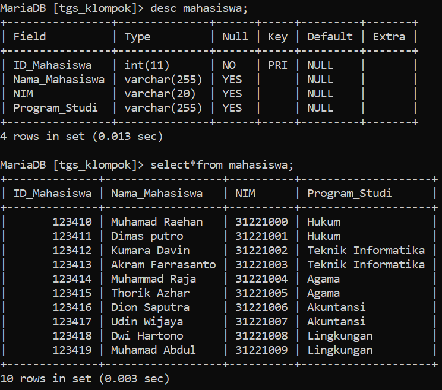
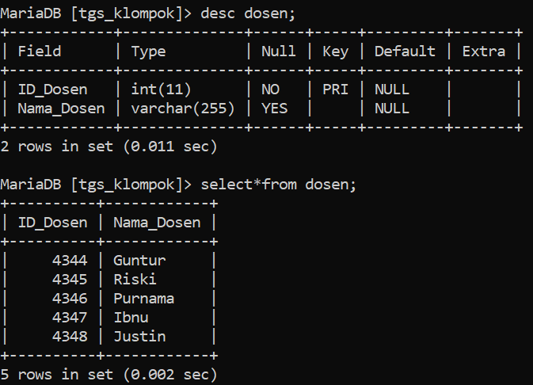
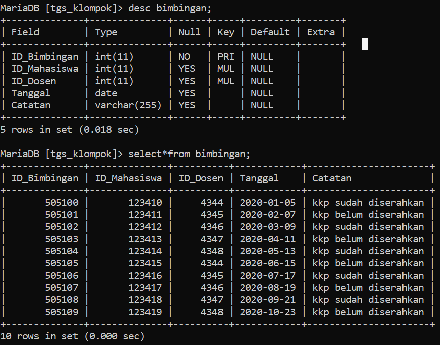
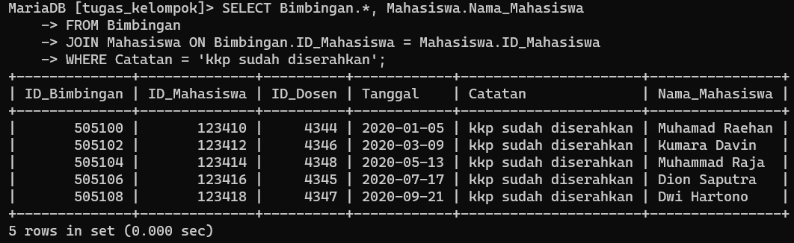
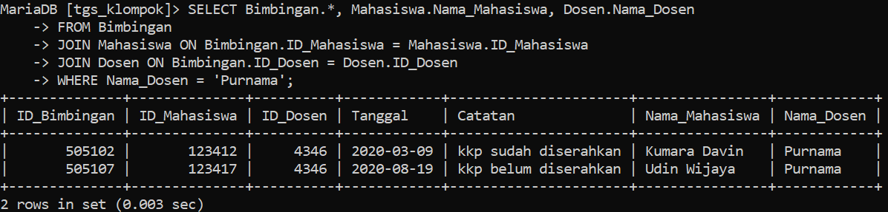
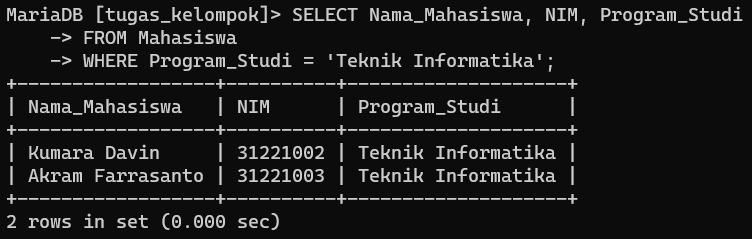
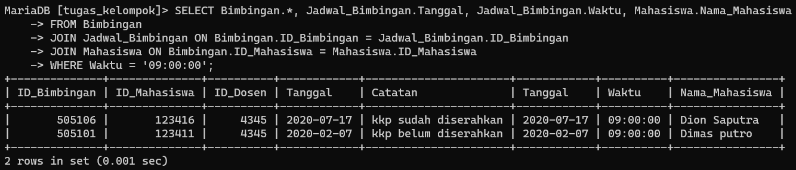

# Database Pengelolaan KKP dan Skripsi

## A. ERD

## B. DDL
#### 1. Membuat Database

#### 2. Membuat Table pada Database
1. Tabel Mahasiswa

2. Tabel Dosen

3. Tabel Bimbingan

4. Tabel Jadwal Bimbingan

5. Tabel Laporan Transaksi

#### 3. Menambahkan constraint
1. Menambahan constraint tabel bimbingan (ID_Mahasiswa) referensi tabel mahasiswa dan tabel bimbingan (ID_Dosen) referensi tabel dosen

2. Menambahan constraint tabel jadwal_bimbingan (ID_Bimbingan) referensi tabel bimbingan

3. Menambahan constraint tabel laporan_transaksi (ID_Mahasiswa) referensi tabel mahasiswa 

## C. SQL CRUD
### (Create) Menambahkan/insert data pada tabel
1. Tabel Mahasiswa

2. Tabel Dosen

3. Tabel Bimbingan

4. Tabel Laporan Transaksi

### R (READ) Membaca atau melihat data dari tabel
1. Tabel Mahasiswa

2. Tabel Dosen

3. Tabel Bimbingan

4. Tabel Jadwal Bimbingan

5. Tabel Laporan Transaksi

### U (Update) Mengubah data yang sudah ada
1. Mengubah nama elma dari data dosen

### D (Delete) Menghapus data pada tabel
1. Menghapus nama elma dari data dosen, pertama menggunakan ini
`SET FOREIGN_KEY_CHECKS=0;`

dan kedua 
`SET FOREIGN_KEY_CHECKS=1;`

## SQL JOIN
## 1. Join antara tabel Bimbingan dengan Mahasiswa bedasarkan ID_Mahasiswa yang menampilkan tabel yang sudah menyerahkan kkp 
`SELECT Bimbingan.*, Mahasiswa.Nama_Mahasiswa FROM Bimbingan JOIN Mahasiswa ON Bimbingan.ID_Mahasiswa = Mahasiswa.ID_Mahasiswa WHERE Catatan = 'kkp sudah diserahkan';`

## 2. Join antara tabel Bimbingan, Mahasiswa dan Dosen bedasarkan ID_Dosen yang menampilkan tabel bedasarkan Nama_Dosen
`SELECT Bimbingan.*, Mahasiswa.Nama_Mahasiswa, Dosen.Nama_Dosen FROM Bimbingan JOIN Mahasiswa ON Bimbingan.ID_Mahasiswa = Mahasiswa.ID_Mahasiswa JOIN Dosen ON Bimbingan.ID_Dosen = Dosen.ID_Dosen WHERE Nama_Dosen = 'Purnama';`

## 3. Menampilkan Nama Mahasiswa bedasarkan Program Studi yang ditampuh
`SELECT Nama_Mahasiswa, NIM, Program_Studi FROM Mahasiswa WHERE Program_Studi = 'Teknik Informatika';`

## 4. Join antara tabel Bimbingan, Jadwal_Bimbingan, dan Mahasiswa bedasarkan ID_Bimbingan yang menampilkan tabel yang bedasarkan Waktu Bimbingan
`SELECT Bimbingan.*, Jadwal_Bimbingan.Tanggal, Jadwal_Bimbingan.Waktu, Mahasiswa.Nama_Mahasiswa FROM Bimbingan JOIN Jadwal_Bimbingan ON Bimbingan.ID_Bimbingan = Jadwal_Bimbingan.ID_Bimbingan JOIN Mahasiswa ON Bimbingan.ID_Mahasiswa = Mahasiswa.ID_Mahasiswa WHERE Waktu = '09:00:00';`
